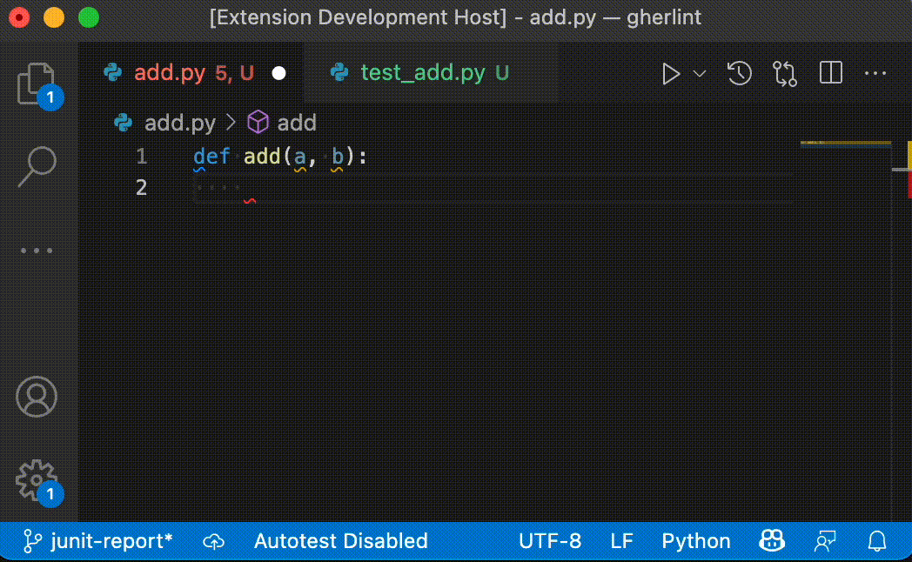

# Test On Save

Tired of switching to the test explorer to run test while working TDD style?
This extension will automatically run them for you when you save a file!

## Features

* Language independent - command to run tests can be set through ``settings.json``
* Can be enabled/disabled through ``settings.json`` or by clicking the status bar icon
* Runs discretely in the background - no annoying popups, only red or green status bar icon displaying last test result
* Exit codes can be mapped to status icons for passing, failed, and errored tests

## Demo

## Requirements

Test On Save runs on VScode 1.62.0 and above.

## Extension Settings

This extension contributes the following settings:

* `testOnSave.enabled`: Enable/disable this extension
* `testOnSave.testCommand`: Command to run tests. Any non-zero exit code is treated as failing tests.
* `testOnSave.languageId`: Only trigger tests when a file of this language is saved. Set to "any" to always run tests after saving.
* `testOnSave.exitCodePass`: Exit code(s) that are considered as a passing test suite. Defaults to 0.
* `testOnSave.exitCodeFail`: Exit code(s) that are considered as a failing test suite. Defaults to non-zero.
* `testOnSave.exitCodeError`: Exit code(s) that are considered as errors when running the tests. Not used by default.

## Known Issues

The following open TODOs and known issues exists:

* allow specification of multiple test commands for different language ids
* use the native testing API of VScode to run tests and get test results, as soon as ``vscode.tests.testResults`` is available outside the [proposed API](https://code.visualstudio.com/api/advanced-topics/using-proposed-api)

## Release Notes

See the [changelog](https://marketplace.visualstudio.com/items/andifin.testonsave/changelog) for details.

## Attributions

Icons made by <a href="https://www.flaticon.com/authors/maxim-basinski-premium" title="Maxim Basinski Premium">Maxim Basinski Premium</a> from <a href="https://www.flaticon.com/" title="Flaticon">www.flaticon.com</a>
